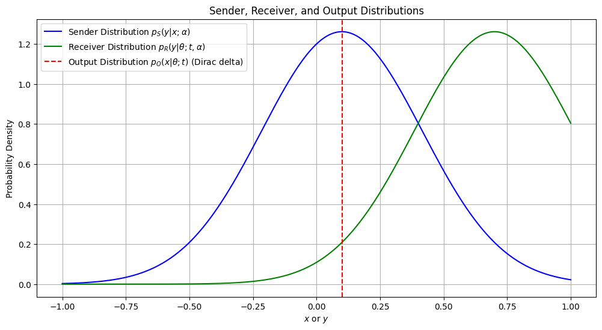
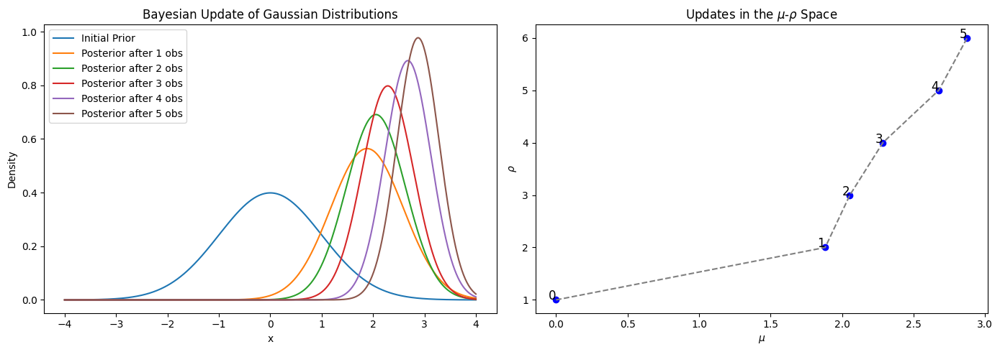
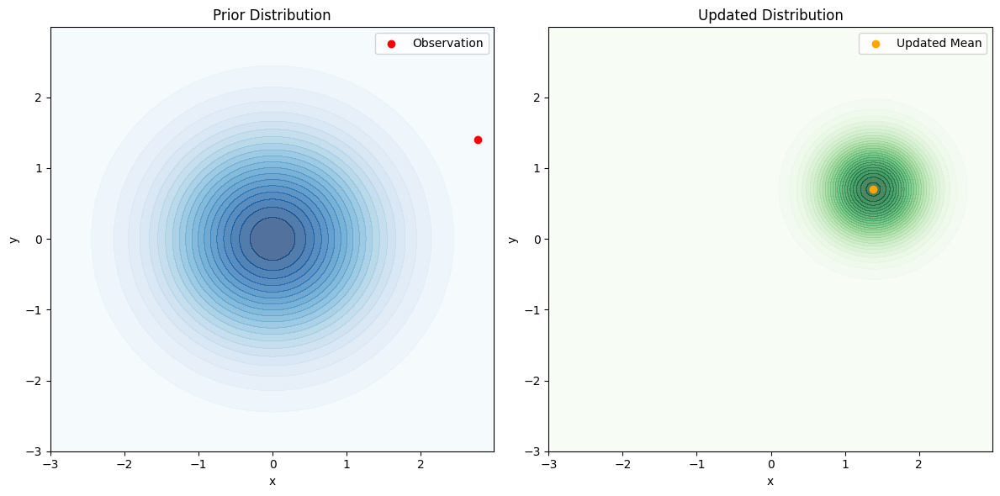

# Bayesian Flow Networks

A Bayesian Flow Network (BFN) is a generative model that integrates Bayesian inference with neural networks. For more details, refer to the [paper](https://arxiv.org/abs/2308.07037).

## How BFNs Work in a Nutshell

BFNs transmit data from a sender to a receiver distribution and receive an output distribution from a neural network. They continuously update their prior to represent the data:

  
  

# Test Case

The test case `bfn/src/test_sinosoidal.py` trains a Bayesian Flow Network (BFN) to generate sinusoidal curves with random amplitudes, frequencies, and phases.

  

